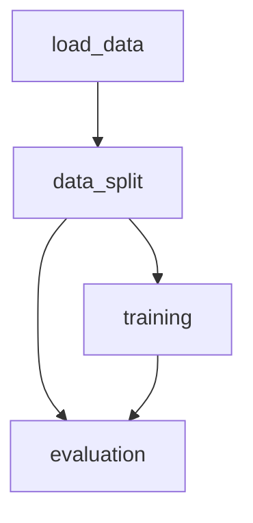

# 🧐 Problem description 
Repo for the project of the week from DataTalksClub with the purpose to learn about DVC,
tool that can be found at: [DVC](https://dvc.org/)

The assignment can be found at: [Assignment](https://github.com/DataTalksClub/project-of-the-week/blob/main/2024-05-22-DVC.md)

DVC is a powerful tool that can be used to version control data, code and models.
It is a great tool to use in conjunction with git to keep track of the changes
and to use in a CI/CD pipeline to automate the training and evaluation of models.

The purpose of this project is to learn how to use DVC to version control data,
code and models, without worrying about the model performance, but to focus on
the DVC usage. With this in mind, the project will use a simple dataset and a
simple model.

# 💾 Data 

The data used in this project is a simple dataset that can be found at
`sklearn.datasets.load_diabetes`.

# 🔄 Pipeline DAG 

The following chart describes the pipeline DAG for the project.

In the `load_data` step, the data is loaded from the
`sklearn.datasets.load_diabetes` dataset and the inputs and target are
concatenated in a single dataframe and saved in the `data/raw` folder.

In the `data_split` step, the data is split in train, validation and test
datasets and saved in the `data/processed` folder.

In the `training` step, the model is trained using the train dataset and saved
in the `models` folder.

In the `evaluation` step, the model is evaluated using the validation dataset
and the metrics are saved in the `metrics` folder using `DVCLive`.

The `dvc.yaml` file describes the pipeline and the dependencies between the
steps and the `params.yaml` file describes the parameters used in the pipeline,
which are very important to keep track of the changes.
